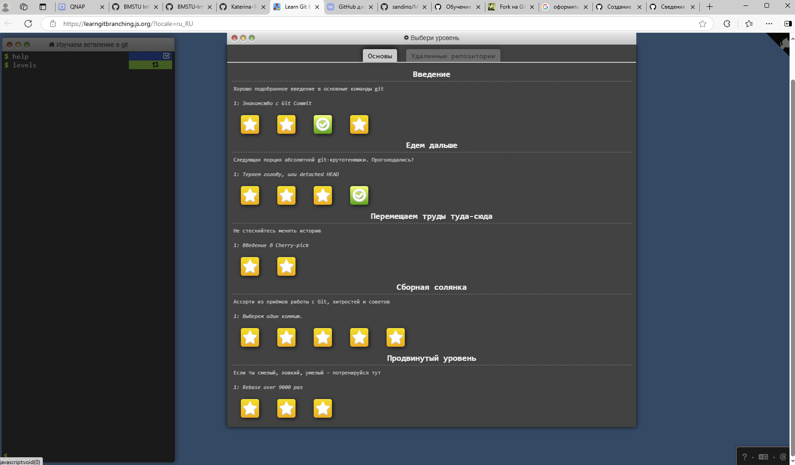

# Отчет по выполнению задания Семинара 1

Мною выполнены следующие задания:
- [ ] Просмотрен GitHub и самостоятельно ознакомилась с его интерфейсом. Просмотрела прилагаемое видео по знакомству с GitHub.
- [ ] Разобралась в терминологии Git (репозиторий, ветка, форк и т.д.), разобралась в отличиях Github и Github Classroom прочитав [соответствующую статью] (https://docs.github.com/ru/education/manage-coursework-with-github-classroom/teach-with-github-classroom).
- [ ] Изучены основы языка [Markdown](https://github.com/sandino/Markdown-Cheatsheet). Формат .md понятен.
- [ ] Создан репозиторий в моём [личном GitHub](https://github.com/Katerina-105/stack_max_vs.git) и опубликована там моя программа из 1 семестра.
- [ ] Пройдена интерактивная обучалка [про ветвление в Git](https://learngitbranching.js.org/?locale=ru_RU).

